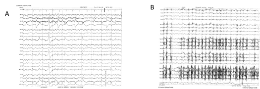
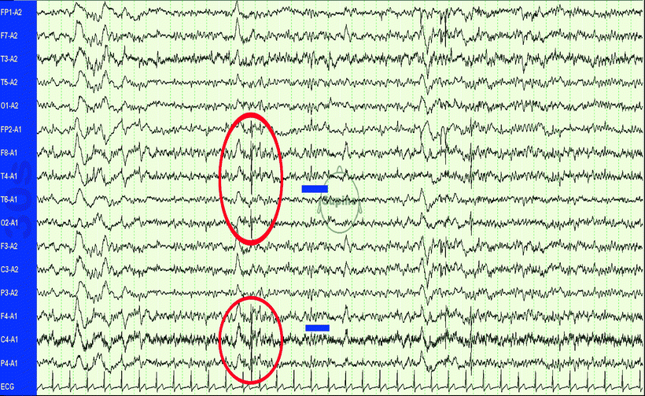
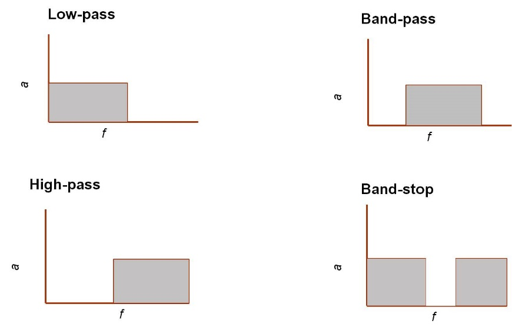

**Introduction** 

Advanced research in neuroscience investigated the functional dynamics of brain through various noninvasive brain imaging techniques. The neuroimaging techniques includes Electroencephalograph (EEG), functional near-infrared spectroscopy (fNIRS), magnetoencephalography (EMG) that measures the bioelectrical signals generated from living beings. EEG is a portable neuroimaging system that assess different functional brain states. It denotes the neurophysiologic recordings of brains spontaneous electrical activity by placing electrodes on the brain scalp. Electroencephalographic measurements are important for identifying brain activity and behavior. It monitors the voltage fluctuations resulting from ionic current within the neurons. This non-invasive method of brain signal monitoring system was widely used in many areas of clinical work and research, even though one of the main challenging factor in using EEG  is its very small signal-to-noise ratio. The characteristic feature of EEG signal is it have a high temporal resolution and easily gets mixed with other biological signals, called artifacts. These unwanted electrical signals that arise from various sources other than the brain, can interfere with the characteristics of neurological phenomena and may negatively use as the source of control in different brain-computer (BCI) systems. Common artefacts are power line noise, muscle contraction, heart activity and eye movement etc. The computational analysis of raw EEG signal from the EEG recordings becomes more complex due to the presence of artifact signals. The unwanted signals have to be eliminated to extract original brain signals and generate a correct EEG data for analysis.

&nbsp;

***Common Artifacts in EEG signals:***

 The most common artifacts in the EEG signal appear during the acquisition due to different causes, like as bad electrodes location, not clean hairy leather, electrodes impedance, etc. Artifacts are mainly classified into two categories: physiological/biological or non-physiological artifacts. 

&nbsp;

***Physiological Artifacts:*** 

Physiological artifacts are a category of artifacts with physiological origin, in contrast to artifacts related to electrical interference. The most significant sources of physiological artifacts are cardiac, pulse, respiratory, sweat, glossokinetic, eye movement (blink, lateral rectus spikes from lateral eye movement), and muscle and movement artefacts(Fig.1).

&nbsp;

&nbsp;

   
Fig 1: Pictorial representation of pulse artifacts(A) and Chewing Artifacts(B) in a window

             
          
&nbsp;

***Non-Physiological Artifacts:*** Also known as technical artifacts arise from outside the body ie from equipment and environment etc. Main source of extra physiologic artifacts are electronic gadgets and transmission-lines. Common non-physiological artefacts are transmission line artifacts, phone artifacts, electrode artifacts, lead movement artifacts, physical movement artifacts. (Fig.2)

&nbsp;

&nbsp;

Fig 2: Common artefacts in an EEG signal.

&nbsp;

**Removal of Artifacts from Bi signals**

Bioelectric signals are stochastic and non-stationary in nature, that means their values are time-dependent and their statistics vary over different points of time. EEG is more inclined towards time-domain as it involves continuous monitoring of neurological conditions of a biological subject over some duration of time. A number of methods have been proposed to minimize the presence of artifacts after EEG acquisition like blind source artifact separation methods, visual inspection of EEG data and manual deletion of artifactual data segments.    A digital filter is a mathematical algorithm that operates on a digital dataset in order extract information of interest and remove any unwanted information. Filtering processes are mainly done to retain the frequency component of the specific signal. The preprocessing of EEG signals is mainly done by applying a high-pass filter to filter out slow frequencies less than 0.1 Hz or 1 Hz and a low-pass filter to filter out frequencies above 40 or 50 Hz. Four basic filtering types.

•	***Low-pass filter*** – all frequencies below a defined frequency are passed and all frequencies above this limit are rejected.

•	***Band-pass filter*** – all frequencies between defined lower and upper frequency limits are passed.

•	***High-pass*** – the inverse of the low-pass filter in which all frequencies above a defined frequency limit are passed and all below are rejected.

•	***Band-stop*** – often referred to as a « notch filter » is the inverse of the band-pass filter; all frequencies between a defined lower and upper frequency limit are rejected.

Filters designed as, the high-pass filter is derived from the low-pass filter and the band-stop from the band-pass. (Fig.3) Low pass filter retains the high frequency and put through the low frequency according to the parameter settings.

&nbsp;

Fig 3: Frequency response of each filtering types.

 
Image source: https://blricrex.hypotheses.org/filtering-introduction

   
&nbsp;

Also, the filters are designed to have a Finite Impulse Response (FIR) or Infinite Impulse Response (IIR).   An impulse response defines how the filter handles a unit impulse signal in the time domain. An FIR filter has an impulse response for a finite duration, after which the output goes to zero and produces equal delays at all frequencies (also known as linear phase response). In contrast, IIR filters (also known as recursive filters) have an infinite impulse response where part of the output of the filter is used as feedback. This produces unequal delays at different frequencies (nonlinear phase characteristics). This means that the output signal is shifted in time with respect to the input with some frequency components shifted more than others.  The main advantage of IIR filters, however, is that they are computationally more efficient. 
Independent Component Analysis

&nbsp;

Component analysis is one of the most important methods used for electroencephalographic (EEG) signal decomposition Independent component analysis (ICA) is commonly used signal preprocessing technique. The main function of the ICA algorithm is to find a linear representation of non-Gaussian data whose elements are statistically independent or at least as independent as possible. Independent Component Analysis (ICA) was used to filter out ocular artefacts and movement-related artifacts from raw EEG data. Advanced Computational application of signal processing techniques, many algorithms were proposed that identifies and remove unwanted noises from the bio signal recordings. Clinically, extraction of exact brain signals and removal of artefacts helps to diagnose diseases without any misleading and also analysis of feedback associated with bio signal-based systems, such as for Brain-Computer Interface (BCI) and neural prostheses.
