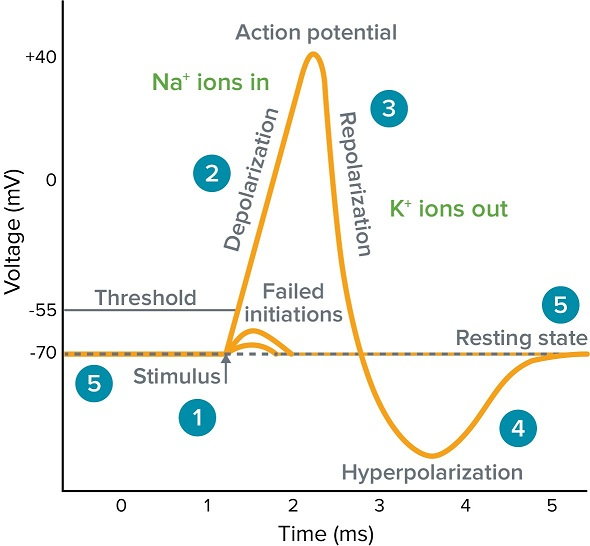
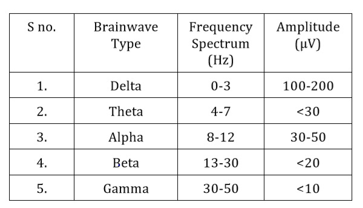

**Introduction**

Biosignals are biomedical signals that originate from living organisms which provides the information about the biological and physiological structures and their dynamics. It allows the communication between biosystems and the primary source of information on their behavior. It also known as bioelectric signals that originate from neural or muscular activity. These bioelectric signals were differ in their amplitude (microvolt to millivolt) and in their frequency. Some of the bioelectric signals are: 

•	The heart which generates electrocardiogram (ECG)

•	The brain which produces electroencephalogram (EEG)

•	 The activity of the muscles that produces electromyogram (EMG)

•	The movement of the eyes generates electrooculogram (EOG)

•	The retina produces electroretinogram (ERG)

These biosignals were exist as time functions and are describable in terms of their amplitudes, frequencies and phases. These complex biosignals are generally controlled by the nervous system which is responsible for the transfer, sending and reception of generated micro- information or less from different body parts to the brain for processing. Studies also reported about bio signal, ie EP/RP (evoked-potential/event-related potential) electrical signals as responses of the brain to external (e.g., visual, auditory) stimuli. The range in frequency is from 1 Hz to 3 kHz and signals have an amplitude from 0.1 μV to 20 μV.

&nbsp;

**Electroencephalogram (EEG) Signals**

EEG signals are produced by the electrical activity of the brain cells. When a neuron fires, an action potential is generated as a result of the exchange of ions that occurs inside and outside the neuron's cell .This causes an alteration in the electrical charge from negative to positive and thus generates an ionic current (extracellular current) that is then propagated through the neuronal axons to other neurons, and as a result an electrical field is generated. This field is propagated throughout the brain and can be recorded by electrodes that are placed around the scalp (Fig.1)

&nbsp;

Fig 1. Generation of Action potential

&nbsp;

**10-20 International EEG Placement System**

International EEG Placement System refers to the internationally standardized method of placement of electrodes at anatomically fixed distances. The anatomical landmarks are namely nasion, inion and the pre-auricular points (left and right). This system ensures consistency between studies to allow a comparison of the EEG of the subjects. It includes the measurements from the nasion (a region where the top of the nose meets the ridge of the forehead) to the inion (the projecting part of the occipital bone at the base of the skull) making the electrode placements proportional to the skull .Specific notations are there on the devices for easy use. They are, Frontal (F) Parietal (P), Temporal (T), Occipital (O).The numbering system is also defined as odd numbers for the left hemisphere and even numbers for the right hemisphere.

&nbsp;

**Brain Rhythms**

EEG signals consist of various brain rhythms (brainwaves) including delta (0.3–4 Hz), theta (4–8 Hz), alpha (8–14 Hz), beta (14–30 Hz), and gamma (>30 Hz), with each one having a clinical importance in disease and pathological diagnosis. EEG signals have been extensively used in clinical research to study potential fluctuations under specific events (i.e., event-related potentials [ERPs]), as well as in various pathologies including epilepsy, schizophrenia, dyslexia and dementia.

&nbsp;

**EEG Artifacts**

Artifacts are unwanted bio signal activities that mainly originated from environment noise, experimental error and physiological artifacts. The environment artifacts and experiment error, which come from external factors, are classified as extrinsic artifacts, (eg: misplace of electrode position, environmental noise), whereas the physiological from body itself (e.g., eye blink, muscle activity, heart beat) can be categorized as intrinsic artifacts. The environment artifacts can be eliminated by a simple filter due to the frequency of such artifacts are inconsistent with desired signals Proper procedure and planning can reduced experimental error easily,wehereas the physiological artifacts are more difficult to be removed as they require particular algorithms .

&nbsp;

**Filtering of Artifacts**

Artefacts in a EEG data can be removed by a good recording protocol including giving instructions to the subject about eye movement, physical movement, banning of mobile in real data recording room etc. common artefacts can be recognized by visual analysis, remontaging, and digital filtering. There are different methods of artefact removal, which include manual and automated method. Automated removal methods use mathematical algorithms and are used in digital EEG record whereas the manual method is offline method.

&nbsp;

***Band Pass Filtering:***

 Band pass filtering can be used to remove particular artefacts, by using a specific range of frequency band of artefacts. This method is not a very useful method for analysis of the entire bandwidth of EEG, as artifacts can occur at any frequency. A 50 Hz notch filter can used for removal of transmission line frequency. Low pass filter can used for oculogram artefact removal.

&nbsp;

***Independent Component Analysis (ICA):***

Independent Component analysis (ICA) also called blind signal separation or blind source separation is a mathematical tool that can help solving the problem of separation of sources and reduction of artifacts in EEG. ICA allows blind separation of sources, linearly mixed, assuming only the statistical independence of these sources. Also verified that the ICA can separate artificial, stimulus-locked, response locked, and non-event related background EEG activities into separate components. Thus ICA method mainly used to separate different independent brain activities during motor imagery into separate components
