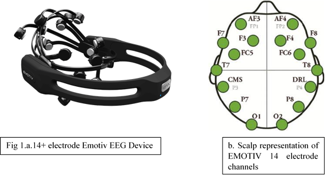
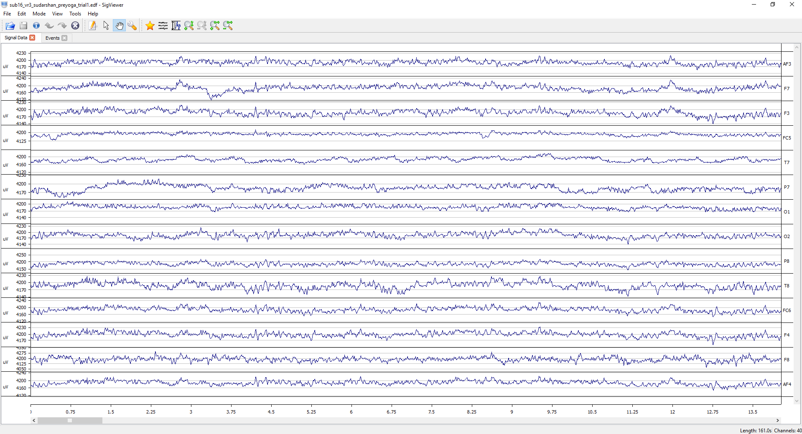

**Introduction**

Bio signals or bioelectric signals are any signals that transduced from a biological or medical sources at molecular level, cell level, systemic or organ level. It consist of  both electrical and non-electrical biosignals.The signals from clinical and research laboratory resources include electrocardiogram (ECG), or electrical activity from the heart; speech signals; the electroencephalogram (EEG), or electrical activity from the brain; evoked potentials (Eps), i.e., auditory, visual, somatosensory, etc.), or electrical responses of the brain to specific peripheral stimulation; the electroneurogram, or field potentials from local regions in the brain; action potential signals from individual neurons or heart cells; the electromyogram (EMG), or electrical activity from the muscle; the electroretinogram (ERG) from the eye; electrooculogram (EOG) or electrical activity from the eye movement etc.

Neuroimaging studies of these physiological signals have been employed for monitoring and estimating various physiological and pathological states for diagnosis of various clinical conditions and evaluating its therapy. Brain research studies helps the neuroscientist to acquire these bio signals by data acquisition, processing, decoding and further modelling of specific biological systems. Among various bioelectrical signals, analysis of EEG signals have been widely employed by the neurologists to monitor electrical activity of brain or evoked potentials that aid in brain function research ,due to its higher temporal resolution and the device low cost and portability. The bio signals exist in time domain functions and are described in terms of their amplitudes, frequencies and phases. 

&nbsp;

**Electroencephalography (EEG)**

Advancements in biomedical signal processing techniques have led Electroencephalography (EEG) signals to be more widely used in the diagnosis of brain diseases and in the field of Brain Computer Interface. Electroencephalography was discovered by Hans Berger and studies on human EEG began in 1924. This technique helps to read brain scalp electrical activity generated from different lobes. This non-invasive method consist of metal electrodes with Ag-AgCl disks and conductive media. EEG measures the action potentials of the pyramidal neurons in the cortex. The action potentials are created by the electrical dipoles between the soma (cell body) and apical dendrites(neural branches) by the influx and efflux of ions( including Na+, Ca++, K+ etc..) through neuronal membranes by the formation of membrane potential. Neuronal excitations produce electrical signals that could be recorded on the head surface. Smallest of the signals are recorded by the EEG device, sensed as fluctuations in the voltage, amplified and plotted on the computer memory. This technique has proven to be useful to study the electrical activity of both normal and an abnormally functioning brain.

&nbsp;

The signals extracted from electrodes are called raw EEG signals. EEG signals are relevant to understand circuit behaviour and brain conditions. Signal identification and processing involves noise removal by various filtrations, quantification of signal models and its components through computational analysis method. Raw signals were visualized through an open-source and browser-based EEG data analysis platform (like Sigviewer software) and each channel locations were identified (Fig2.)

&nbsp;

Fig.2 EEG data visualization in time series plot. Measured voltages in µV were shown against time in seconds.

&nbsp;

Electric brain potentials were recorded using an Emotive Epoc headset include 14 electrode channels based on saline sensors placed on the scalp(Fig1a/b). Inspecting and visualising the action potentials generated from the brain is the basic step of data processing pipeline. Visualization of a raw EEG data helps to understand the data quality, for detecting segments contaminated with artifacts or noises, identifying noisy channels and inspecting the events that accompanied with the data. The EEG data has been visualised in a simple time series plot. The time is set out horizontally and voltage vertically. The channels identified are AF3,AF4,F3,F4,F7,F8,FC5,FC6,T7,T8,P7,P8,O1 and O2.After the data acquisition and visualization, important steps like pre-processing, feature extraction, feature selection and classification of signals based on selected features were done to obtain an actual readable signals. This signals were imported to an EEGLAB software in Matlab for computational analysis of the data. The analysed EEG data were accounted to report clinical conditions attributed to neurological states of the brain circuits and human or animal behaviours. Some of the relevant open source tools that available for the visualization of EEG biosignals include MATLAB-based toolboxes EEGLAB, Fieldtrip Brainstorm, Biosig and the Python package MNE .
