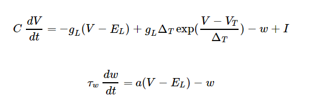

**Introduction**

&nbsp;
Neurons are the basic building blocks of central nervous system specialized to transmit information’s throughout the body. Neurons communicate signals to target cells (other nerve cells, muscles or glands) in both chemical and electrical forms. The structure of neurons consists of a cell body, an axon, and dendrites. The axon extends from the cell body to form many smaller branches before ending at nerve terminals. Dendrites extend from the neuron cell body and receive messages from other neurons. Synapses are the contact points where one neuron communicates with another. The dendrites are covered with synapses formed by the end of axons from the other neurons. Different types of neurons were assigned for different tasks in the human body. Sensory neurons carry information from the sensory receptor cells throughout the body to the brain. Motor neurons transmit information from the brain to the muscles of the body. Interneurons are responsible for communicating information between different neurons in the body. Also, a specialized neurons called Purkinje cells were found at cerebellar regions of brain with highly complex dendritic tree that allows them to receive and integrate an enormous number of synaptic inputs.
&nbsp;
&nbsp;

**Synapses**
&nbsp;

Synapse, also called neuronal junction, the site of transmission of electric nerve impulses between two nerve cells (neurons) or between a neuron and a gland or muscle cell (effector). A synaptic connection between a neuron and a muscle cell is called a neuromuscular junction. A neuronal synapse consists of three components (Fig.1); 

1.	*Pre-synaptic terminal*: An axonal terminal forms the pre-synaptic terminal of a synapse. When a nerve impulse arrives at a presynaptic terminal, it causes synaptic vesicles to fuse with the plasma membrane such that the neurotransmitters present in the vesicle are dumped into the synaptic cleft. 

2.	*Synaptic cleft*: The synaptic cleft is a space between the pre-synaptic and post-synaptic neurons. The neurotransmitters released into the cleft diffuse through it to reach the post-synaptic neuron. Neurotransmitters remain in cleft for only some time. They are either taken up by the presynaptic neuron or are broken down by the enzymes present in the synaptic cleft. The typical synaptic cleft is about 0.02 micron wide.

3.	*Post-synaptic neuron*: The post-synaptic neuron contains several receptors on its plasma membrane. The neurotransmitters bind to these receptors and initiate a nerve impulse by causing depolarization. In this way, a nerve impulse is transferred from one neuron to the other via a synapse.

&nbsp;

**Synapse Communication :**
&nbsp;
On the basis of mechanisms of nerve impulse transmission, synapses divided into two: electrical synapses and chemical synapses. 

1.	**In an electrical synapse**, the cytoplasm of two or more cells is interconnected via gap junctions. Thus, the ions can freely move from one cell to the other. It has a direct physical connection between the presynaptic neuron and the postsynaptic neuron. Thus, the depolarization in any one cell causes depolarization of all the connected cells. The gap junctions between electrical synapses are much smaller than that of a chemical synapse (about 3.5 nanometres compared to 20 nanometres. Electrical synapses transfer signals much faster than chemical synapses). Electrical synapses are excitatory only. These synapses are seen in cardiac myocytes.

2.	**In a chemical synapse**, the nerve impulse is transmitted from one cell to the other via chemical substances called neurotransmitters. The electrical activity in the presynaptic neuron triggers the release of chemical messengers. The neurotransmitters diffuse across the synapse and bind to the specialized receptors of the postsynaptic cell. The neurotransmitter then either excites or inhibits the postsynaptic neuron. Excitation leads to the firing of an action potential while inhibition prevents the propagation of a signal. Chemical synapses can be both excitatory or inhibitory. Most of the neuronal synapses are chemical synapse.
&nbsp;

**Neurotransmitters**: These chemical messengers were made by the neurons specifically to transfer information’s among the nerve cells. Some neurotransmitters are excitatory ie target neurons were more likely to fire an action potential whereas others are inhibitory ie target neurons were less likely to fire an action potential.  For example, Glutamate is the main excitatory transmitter in the central nervous system. GABA is the main inhibitory neurotransmitter in the adult vertebrate brain. Glycine is the main inhibitory neurotransmitter in the spinal cord. Some neurotransmitters are: 

•	Acetylcholine: Associated with memory, muscle contractions, and learning. A lack of acetylcholine in the brain is associated with Alzheimer’s disease.

•	Endorphins: Associated with emotions and pain perception. The body releases endorphins in response to fear or trauma.

•	Dopamine: Associated with thought and pleasurable feelings. Parkinson’s disease is one illness associated with deficits in dopamine.

&nbsp;

**Synapse Dynamics:**

&nbsp;
Synapses are crucial elements for computation and information transfer in both real and artificial neural systems. Connections between neurons form network which are non-static in nature ie it changes in amplitude and timing. Synaptic dynamics describes the time-dependent changes in synaptic currents that alter the strength of coupling between neurons. Various mechanisms, both pre- and postsynaptic, contribute to changes of synaptic currents and modulate the overall network activity. These mechanisms operate on various time scales (milliseconds to years) and can lead to immediate changes in neuronal activity, ongoing adaptation of neuronal responses to changing inputs, and long-term learning and memory. synaptic dynamics can play a crucial role for learning neural codes and encoding spatiotemporal spike patterns. The synaptic dynamics studies were generally conducted in ex vivo preparations and it helps to understand the properties and functions of synaptic signal transmission by various neural networks.

&nbsp;

Fig1: Structure of a neuron and the synapse.

&nbsp;

**Synaptic Network Connectivity Modelling**

&nbsp;
Mathematical modeling of neural networks was used to study the direct effect of internal or external changes on brain dynamics. Neural modeling aids to investigate and understand the mechanisms of information-processing units, codes, and networks and their relation to capabilities of living systems. Representation of all neurons of human brain by simulation at both high temporal and high spatial resolution is impossible for longer time-scales due to the massive computational and memory requirements needed for the computational modelling. 

&nbsp;

**Adaptive exponential integrate-and-fire model:**

&nbsp;
The adaptive exponential integrate-and-fire (AdEx) model, a spiking neuron model with two variables were used to model synaptic connectivity. AdEx reproduces multiple firing patterns and study the correspondence between the parameters and the firing types. In AdEx model, the first equation describes the dynamics of the membrane potential and includes an activation term with an exponential voltage dependence. Voltage is coupled to a second equation which describes adaptation. Both variables are reset if an action potential has been triggered. The combination of adaptation and exponential voltage dependence gives rise to the name Adaptive Exponential Integrate-and-Fire model. The adaptive exponential integrate-and-fire model is capable of describing known neuronal firing patterns, e.g., adapting, bursting, delayed spike initiation, initial bursting, fast spiking, and regular spiking. 

&nbsp;

&nbsp;

where *V* is the membrane potential, *w* the adaptation variable, *I* the input current, *C* the membrane capacitance, *gL* the leak conductance, EL the leak reversal potential, *VT* the threshold, *ΔT* the slope factor, the adaptation coupling parameter and *τw* is the adaptation time constant. AdEx model is a single compartmental model which reproduces multiple firing patterns depending on parameters such as: spike-frequency adaptation, regular and fast spiking, phasic spiking, phasic and tonic bursting, post-inhibitory spiking and bursting, delayed spike initiation and delayed burst initiation and damped oscillations. The AdEx model represents an attractive candidate neuron model for use in large-scale network simulations.
