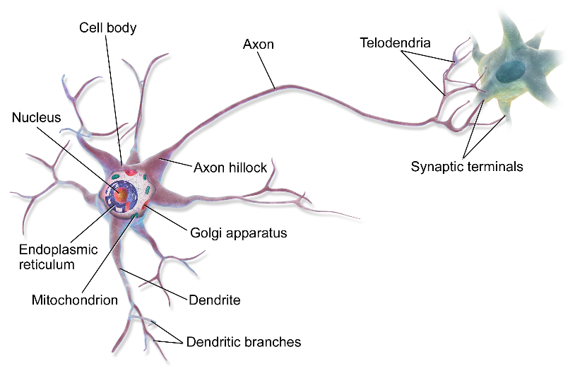
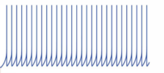

**Introduction**

The central nervous system is made up of two basic types of cells: neurons and glia. Neurons are the fundamental units of the brain and nervous system, the cells responsible for receiving sensory input from the external world, for sending motor commands to our muscles, and for transforming and relaying the electrical signals at every step in between.
Neurons are information messengers. They use electrical impulses and chemical signals to transmit information between different areas of the brain, and between the brain and the rest of the nervous system. Everything we think and feel and do would be impossible without the work of neurons and their support cells, the glial cells called astrocytes and oligodendrocytes Neurons have three basic parts: a cell body and two extensions called an axon and a dendrite. Within the cell body is a nucleus which controls the cell’s activities and contains the cell’s genetic material. The axon looks like a long tail and transmits messages from the cell. Dendrites look like the branches of a tree and receive messages for the cell. Neurons communicate with each other by sending chemicals, called neurotransmitters, across a tiny space, called a synapse, between the axons and dendrites of adjacent neurons (Fig1)

 &nbsp;
 
 

 

 
Fig 1: Structure of Neuron

 &nbsp;
 
 **Spiking of Neurons**

Neurons in the brain, communicate with each other using stereotyped electric pulses, called spikes. TAction potentials in neurons are also known as "nerve impulses" or "spikes", and the temporal sequence of action potentials generated by a neuron is called its "spike train". A neuron that emits an action potential, or nerve impulse were “fired”. The neurons convey information mainly through the frequency of the transmitted spikes, called the firing rate. Also, neurons may communicate some information through the finer temporal patterns of the spikes. Neuronal firing patterns may depend on cellular organization, which varies among the regions of the brain, according to the roles they play, such as sensation, association, and motion.

 &nbsp;
 
 Spiking Neural Networks: Spiking neural networks (SNNs) are artificial neural networks that similar to natural neural networks. SNNs were inspired by the brain and the communication scheme that neurons use for information transformation through discrete action potentials in time through adaptive synapses. In a biological neuron, a spike is generated when the running sum of changes in the membrane potential, which can result from presynaptic stimulation, crosses a threshold. The rate of spike generation and the temporal pattern of spike trains carry information about external stimuli and ongoing calculations. SNNs use a very similar process for spike generation and information transformation.  A neuron model that fires at the moment of threshold crossing is also called a spiking neuron model. spiking neural networks, aims to bridge the gap between neuroscience and machine learning, using biologically-realistic models of neurons to carry out computation some of Spiking neuron models are Integrate-and-Fire (I&F) and Leaky-Integrate-and-Fire (LIF),Quadratic-Integrate-and-Fire (QIF) and Theta neuron,I zhikevich’s neuron model, Spike Response Model, adaptive exponential integrate and fire neuron model (AdEx) Model etc.The most commonly used  spiking neuron model is the integrate-and-fire model.

  &nbsp;
  
  **AdEx model of Spiking Neural Network:** 

To understand the dynamical behavior of the brain, a large number of different biological building blocks need to be connected to each other in a complex and structured pattern similar to Central Nervous System (CNS). Studying this dynamical behavior of the neurons is a crucial step and plays an important role in developing biological neural networks. Thus the mathematical modeling of neural dynamics and spiking neural network mechanisms have been a strong tool in analyzing and processing behavior of biological neural networks. Mathematically, dynamical behavior of the biological neurons can be described in different accuracy levels, using differential equations.

 &nbsp;
 
 For simulations of large spiking neuron networks, an accurate, simple and versatile single-neuron modeling framework is required.A spiking neural network using adaptive exponential integrate and fire neuron model (AdEx) were developed to understand how cerebellar circuits associate spiking information during learning. It based on cerebellar molecular layer perceptron-Iike architecture and estimated the maximal storage capacity at parallel fiber-Purkinje Cells synapse. Most neuronal network receive input and converted into timed spike trains where patterns are transformed and understood by neurons at the higher level,whereas Adaptive Exponential leaky integrate and fire model (AdEx) model convert the input into multiple firing patterns(Fig.2). Spiking Neural Neworks with specific neural architectures challenges new neuron models and learning techniques. Spiking neurons communicate through discrete spike trains via synapses adapting locally to distinguish the pattern of stimuli. Also an important challenge in developing SNNs is to develop appropriate learning rules to detect spatiotemporally local patterns of spike trains. 

 &nbsp;

Fig 2: Multiplie firing patterns of neuronal cells
