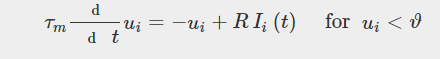
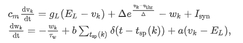

Human brain consists of millions of neurons which are organized in different brain areas and within a brain area in different subregions to different layers and to various cell types. In brain regions neurons with similar properties were organized as a population of cells. The collective properties of groups of neurons activated by a stimulus to generate an action potential for signal transmission were defined as Neuronal population. The responses of neuronal population to same stimulus are typically correlated to each other and an identical neuronal population perform many functions relating to cognitive tasks. Neuronal population analysis characterizes the activity of large groups of neurons. Both Excitatory and inhibitory neurons population activity were mathematically modelled to emulate firing pattern of spiking networks of brain circuits.

Excitatory and inhibitory neurons appear to perform distinct roles in cortical networks. Excitatory neurons form long range synaptic projections and have clustered connectivity with other excitatory neurons. inhibitory neurons form local, dense, and non-specific connections .Excitatory neurons are almost exclusively pyramidal cells, while inhibitory neurons form a diverse class with multiple subtypes .In many cases, inhibitory neurons exhibit greater firing rates than excitatory neurons, more attentional modulation and a lesser degree of burstiness .Excitatory neurons are critical for long-term synaptic potentiation whereas inhibitory neurons are instead postulated to modulate stimulus response gain, sharpen tuning to stimuli, and pace cortical oscillations. The network-level roles of excitation and inhibition of neurons and their interaction with other neuronal population were analyzed and mathematically modelled using different algorithms.

Understanding neural circuits were critically on understanding spikes across neuronal populations. The computational modeling of population of neurons describes the interactions between neural elements and the neural mechanisms underlying various cognitive functions like memory and learning, motor execution and planning visual perception. Thus the large-scale recordings of neural systems and their complex dynamics were modelled using different computational models like Hodgkin–Huxley model, fire and integrate model, Izhikevich’s neuron model, and AdeX model.

&nbsp;
**Neuronal Population Activity Structure**

&nbsp;
The patterns of activity produced by a population of neurons were referred to as population activity structure and it depends on each neuron type. It helps to understand the interconnection and activation of average neuronal population response properties of different neuron types and their network-level dynamics. The population response is nonstationary in nature and the population activity changes between different states on a range of timescales, from shifting global dynamics on timescales of seconds to minutes and to hours depending on the efficiency of a network.

Neuronal population activity was described as follows. In a population of NN neurons, we calculate the proportion of active neurons by counting the number of spikes in a small time interval. The division of Δt\t yields the population activity

&nbsp;

&nbsp;
where δ\delta denotes the Dirac δ\delta function. The double sum runs over all firing times t(f)jt_{j}^{(f)} of all neurons in the population. The activity AA is defined by a population average. The activity has units of a rate and often called the population rate. The population activity is quite different from the concept of a mean firing rate defined by temporal averaging in a single neuron. The ’neural mass models’, predict the temporal evolution of the population activity A(t)A(t) in large and homogeneous populations of spiking neurons.

&nbsp;

**Homogenous and Heterogenous Neural Networks**
&nbsp;

***Homogenous Network***: 

A large and homogeneous population of neurons were modeled by mathematical algorithms. homogeneous neuronal population means that (i) all neurons were identical; (ii) all neurons receive the same external input and (iii) the interaction strength for the connection between any pair of pre- and postsynaptic neurons is ’statistically uniform’. All neurons were independent and the) implies excitatory (inhibitory) coupling. 

Homogeneous population of integrate-and-fire neurons equation follows:

&nbsp;

&nbsp;

***Heterogenous Networks:***

N neurons in the population receive the same input I, considered to be constant for the moment, but parameters vary slightly between one neuron and the next. Because of the difference in parameters, the stationary firing rate νi=gθi(I) of neuron I is different from that of another neuron j. The index θi refers of the set of parameters of neuron i. The mean firing rate averaged across the population is ⟨ν⟩=∑iνi/N.The firing rate is a smooth function of the parameters and the differences between parameters of one neuron and the next are small to  linearize the function g around the mean parameter value θ and find  the mean firing rate averaged across the population.

&nbsp; 
**Neural Response Features**
&nbsp;

Population activity can be measured using multi-neuron recordings and neuroimaging. Neural recordings reveal how the heterogeneity, sparseness, timing, and correlation of population activity shape information processing in local network. Understanding a population code requires investigating its statistical properties along all relevant dimensions and linking them to the external events that are encoded (for example, sensory inputs). Informative response features can spread across the dimension of time (temporal variations in the responses of individual neurons or of the population), space (stimulus tuning differences in the firing of different neurons), or along non-separable combinations of both dimensions. The characteristic features of neural response were Relative timing, Network state modulation, Periods of silence.

•	*Relative timing*: In a population, informative response patterns can include the relative timing between neurons.

•	*Network state modulation*: Neural responses depend not only on sensory inputs but also on large-scale brain states that vary on timescales slower than the transient responses to individual stimuli. In the example, these are represented by a slow wave of a mass signal eg: an LFP filtered into a low-frequency component.

•	*Periods of silence*:  Neural populations also encode information by the silence (i.e absence of firing) of some neurons.

**Local Field Potential (LFP)**

Local field potentials (LFPs) represent the aggregate activity of small populations of neurons represented by their extracellular potentials. A neurophysiological signal obtained by low-pass filtering extracellular recordings. It captures slow components of both sub- and supra-threshold neural activity. The biophysical computations underlying extracellular recording technique aided in the development of reliable quantitative mathematical models that elucidate the generation of extracellular potential (LFP) from transmembrane ionic currents. For an evoked post-synaptic activity, Local Field Potential (LFP) is the signal recorded below 500 Hz (low-frequency component) and high frequency component (>500 Hz) has been referred as Multi Unit Activity (MUA). LFPs are population signals presumed to be composed of several components, including synaptic transmembrane current, action potentials and sodium currents, calcium spikes, and ephaptic contacts. LFP of a population of neurons were modeled by AdeX model. The LFP is generated by electric currents and charges in brain cells, including neurons and glial cells. In particular, all ionic currents in neurons can potentially contribute to the LFP. The main contribution to LFPs is believed to be the synaptic currents in neurons, although intrinsic voltage-dependent currents and spikes can also contribute. The LFP also interacts with the extracellular medium, through several mechanisms, such as capacitive effects, polarization, or ionic diffusion.

Neural population networks of complex integrate-and-fire models featured by spike-frequency adaptation, modeled by the Adaptive Exponential (AdEx) integrate-and-fire model. AdEx model permits to define two cell types, “regular-spiking” (RS) excitatory cells, displaying spike-frequency adaptation, and “fast spiking” (FS) inhibitory cells, with no adaptation. The dynamics of these neurons is given by the following equations:

&nbsp;

&nbsp;

where *cm* is the membrane capacitance, *vk* is the voltage of neuron *k* and, *vk* is reset to the resting voltage.

