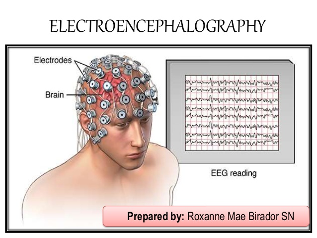
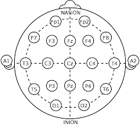
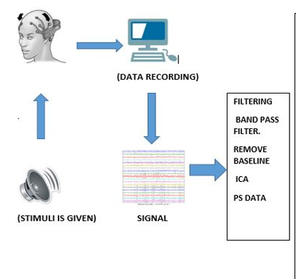
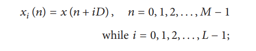
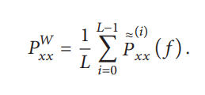

**Introduction**

A human brain is a complex nature and understanding the nature of interconnected neurons needs information signals from the brain. The brain electrical activity is represented by the electroencephalogram (EEG) signals. It’s a non-invasive neurological diagnostic modality that measure the action potentials from neurons. The EEG data provide brain activity information. The recorded waveforms reflect the cortical electrical activity. The EEG signal intensity is quite small, measured in microvolts (mV).

Clinically EEG were used to diagnoses many neurological impairments like epilepsy, Parkinson’s Disease, Alzheimer’s Diseases etc. The recoding of the EEG signals is performed by fixing an electrode on the subject scalp using the standardized electrode placement scheme ie 10–12 international Placement system.. However, the EEG signals were mixed up with unwanted noises or artifacts. The major sources of the artifact are muscular activities, blinking of eyes during signal acquisition procedure, and power line electrical noise. Many methods have been introduced to eliminate these unwanted signals. Each of them has its advantages and disadvantages. 

&nbsp;

Fig 1.A: Electroencephalographic Technique
                     
&nbsp;

Fig 1.B.10-12 International placement system
       

&nbsp;

&nbsp;

**EEG Data Acquisition and Preprocessing**

The process of methodologies for EEG signal processing is divided into 4 stages which are data acquisition, preprocessing, feature extraction and classification. (Fig.2) The path includes acquisition of signal, removal of artifacts, signal averaging, thresholding of the output, enhancement of the resulting signal, and finally, edge detection. The second step in the operation is the feature extraction scheme which is meant to determine a feature vector from a regular vector. A feature is a distinctive or characteristic measurement, transform, structural component extracted from a segment of a pattern. Statistical characteristics and syntactic descriptions are the two major subdivisions of the conventional feature extraction modalities. Feature extraction scheme is meant to choose the features or information which is the most important for classification exercise. The final stage is signal classification which can be solved by linear analysis, nonlinear analysis, adaptive algorithms, clustering and fuzzy techniques, and neural networks. This is done by exploiting the algorithmic characteristics of the feature vector of the data input and thus gives rise to a hypothesis.

&nbsp;

Fig2. EEG Data Acquisition and Preprocessing

&nbsp;

**Power Spectrum Analysis of EEG Data**

Power spectral analysis (PSD) is a well-established method for the analysis of EEG signals. Estimating the power in different frequency ranges is the most ubiquitous analysis performed in the EEG. This requires a transformation of the EEG time series from the time domain to the frequency domain. The power spectral density (PSD) is typically estimated using a (discrete) fourier transform or DFT, which provides information about the power of each frequency component. Programming languages like MATLAB, python and R provide ready-made implementation of functions to compute the DFT for a given signal or time series, using the fast Fourier transform (FFT) algorithm. Estimation of PSD depends on various parameters like window length, percentage of overlap between the windows and number of DFT points. It is important to understand how changing these parameters can impact the final result.

Power spectral density (PSD) can be estimated by computing the magnitude squared of its DFT. In MATLAB, this is achieved by simply using the command fft. The fft command basically needs two inputs – the signal vector (x) and number of DFT points (N). The parameter N determines the frequency resolution (how many Hz each DFT bin represents) of the spectrum based on the sampling frequency which is given by freq res = (fs / N).
                                                                    
&nbsp;
&nbsp;

**Estimating PSD with Fast Fourier Transform (FFT)**
Fast Fourier Transform (FFT) Method employs mathematical means or tools to EEG data analysis. Characteristics of the acquired EEG signal to be analyzed are computed by power spectral density (PSD) estimation in order to selectively represent the EEG samples signal. However, four frequency bands contain the major characteristic waveforms of EEG spectrum. The PSD is calculated by Fourier transforming the estimated autocorrelation sequence which is found by nonparametric methods. One of these methods is Welch’s method. The data sequence is applied to data windowing, producing modified periodograms. The information sequence 𝑥𝑖(𝑛) is expressed as

&nbsp;

&nbsp;

𝑖𝐷 to be the point of start of the 𝑖th sequence and the  𝐿 of length 2𝑀 represents data segments that are formed. Whereas the average of these modified periodograms gives Welch’s power spectrum as follows: 

&nbsp;

&nbsp;

EEG signals were nonstationary in nature and different common methods were employed for Signal featuring, Extraction and analysis. Other methods are Wavelet Transform (WT) Method, Discrete Wavelet Transform (DWT), Autoregressive Method, Burg’s Method etc. Also, its challenging to select the method used for the signal extraction, however these extracted features express the states of the brain for different mental and cognitive tasks. The speed and accuracy of the feature extraction stage of EEG signal processing are therefore very crucial, in order not to lose vital information at a reasonable time.