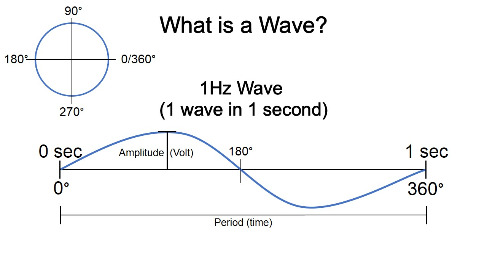
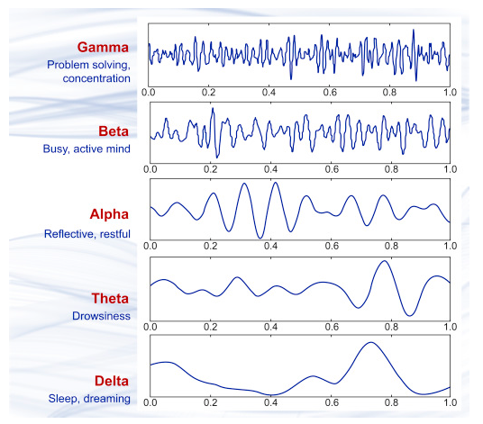
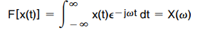
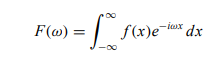

**Introduction**

Electroencephalogram (EEG) is one of the most challenging technology in the field of biomedical engineering that helps to understand and analyse humans varying mental and cognitive states. EEG signal processing helps to explore the uniqueness of brain signal that carries thousands of information in human being. Combination of EEG and brain computer interface (BCI) leads to significant innovations in neuroscientific community. An EEG-based BCI system helps to rebuild neuroprosthetic devices i.e. the neuromuscular bypass by an external device. The brain potentials recorded by electrode placed on the scalp are transformed into commands to control the robotic arm, exoskeleton, wheelchair or other robot. Most BCI research focused on non-invasive neuroimaging technique such as electroencephalogram (EEG) for understanding spatial, temporal and spectral characteristics of brain associated with various cognitive tasks such as attention, memory, motor co-ordination, visual and auditory perception.

EEG is the biological signal measured by attaching a sensor to a scalp and amplifying the voltage. EEG reflected the cerebral electrical activity. The EEG electrode placement and the wave patterns were unified by the 10-20 electrode system. EEG is one of the more favourable brain imaging methods to understand the brain dynamics .One of the characteristics features of EEG signals is it has a high temporal resolution and poor spatial resolution.

&nbsp;

**Brain Activity Patterns**
The electroencephalogram depicts the electrical activity occurring at the surface of the brain. EEG waveforms are generally classified according to their frequency, amplitude and shape, as well as the sites on the scalp (ie electrode positions in brain lobes) at which they are recorded.

&nbsp;

**Brain Wave**
Brain waves consists of a period (how long one wave is), an amplitude (how large a wave is), and frequency (how fast the waves are coming). Period is measured in time, and often taken from the peak of one wave to the peak of the next wave. Amplitude of brain waves are recorded in voltage, as it reflects the movement of electrically charged particles in the brain, ions. Frequency is how many waves come within one second, expressed in Hertz (Hz) (Fig.1).
    

&nbsp;

Fig.1: Pictorial representation of 1Hz wave (1 wave in 1 sec)

&nbsp;

Depending on the range of oscillating frequencies EEG waveforms were classified into into 5 sub frequency bands namely alpha (8 – 13 Hz), beta (13 – 30 Hz), gamma (30 – 100 Hz), theta (4 – 8 Hz) and delta (1 – 4 Hz)(Fig.2). The brain wave patterns have its own characteristics and are unique for every individual.

&nbsp;

•	***Delta waves***, are in the frequency range from 0.1 to 3 Hz. They are highest in amplitude and it is the slowest wave. Delta waves generally occur in deep sleep and sometimes when awake. They also occur in coma mental state. 

&nbsp;
•	***Theta waves***, are in the frequency range from 3 to 7 Hz. They arise during creative thinking, stressed and deep meditating state.

&nbsp;
•	***Alpha waves***, are in the frequency range from 8 to 12 Hz. They dominate in relaxed and calm mental states Alpha waves are reduced with open eyes, drowsiness and sleep. The mature alpha wave has 10 waves per second. Alpha waves are present at different stage of the wake-sleep cycle. 

•	***Beta waves*** are ranging from 13 to 30 Hz. They are associated to deep thinking, high concentration level and anxious state. Beta waves originate from central area of the brain and front side of head. Over the motor cortex beta waves are associated with the muscle contractions and are suppressed prior to and during movement changes. Beta activity is increased when movements has to be resisted or voluntarily suppressed. 

•	***Gamma waves*** ranging from 30-100Hz are the fastest of brain waves (high frequency) that relate to simultaneous processing of information from different brain areas. Gamma brainwaves pass information rapidly and quietly. Gamma rhythms modulate perception and consciousness, and that a greater presence of gamma relates to expanded  consciousness and spiritual emergence 
 

&nbsp;

                            
                                                   

Fig.2: Brain activity patterns (Brain Rhythms)
 

&nbsp;

**Relative / Absolute Power Spectral Density (PSD)**
Relative PSD is defined as the ratio of the PSD to the frequency band to be analysed and the total frequency band. The advantage of the relative PSD is that in the conduction of the skull and scalp, the inter-individual deviation associated with absolute power due to the inter-individual difference is reduced. However, the disadvantage of relative PSD by definition is that only a change in one frequency band, the total frequency band of the denominator, affects the change in the relative PSD. 

For example, the force of a specific frequency band and the object to be analyzed does not change, but as the PSD increases in other frequency bands, the relative PSD decreases. Therefore, it is difficult to accurately analyse brain changes from the viewpoint of a specific frequency band based on the relative PSD. Therefore, both relative and absolute PSD analysis is important for accurate analysis of the brain.

Power spectrum analysis assumes that the EEG is a linear combination of simple vibrations that vibrate at a specific frequency, and decomposes each frequency component in this signal to indicate its magnitude (or power). Frequency resolution is an important indicator for evaluating the performance of power spectrum. The role of power spectrum estimation in random signal analysis is similar to that of Fourier spectrum in determinate signal. It mainly includes classical and modern spectrum estimation methods. Classical methods are nonparametric methods, in which the estimation of power spectrum is made directly from the signal itself. The simplest method is the Periodgram method and an improved method of Period gram is the Welch method

&nbsp;

**Estimation of Power spectrum density in Varying Window Width**

Power spectral estimation of periodic and random signals important application areas of digital signal processing (DSP). The frequency domain analysis or spectral density estimation decomposes a complex signal into simpler parts. Any process that quantifies the various amounts (e.g. amplitudes, powers, intensities) versus frequency (or phase) can be called spectrum analysis. Spectrum analysis can be performed on the entire signal. Alternatively, a signal can be broken into short segments (sometimes called frames), and spectrum analysis may be applied to these individual segments. Spectral analysis can provide an efficient quantification of overall broadband rhythms present in an EEG epochs.

General mathematical techniques for analysing non-periodic functions fall into the category of Fourier analysis.  The relationships between the time domain and its corresponding frequency domain representation is the subject of Fourier analysis and Fourier transforms. The forward Fourier transform (FFT), time to frequency domain, of the function x(t) is defined:

&nbsp;

Fast Fourier transform (FFT) is an algorithm that calculates the discrete Fourier transform (DFT) of some sequence – the discrete Fourier transform is a tool to convert specific types of sequences of functions into other types of representations. Another way to explain discrete Fourier transform is that it transforms the structure of the cycle of a waveform into sine components.

